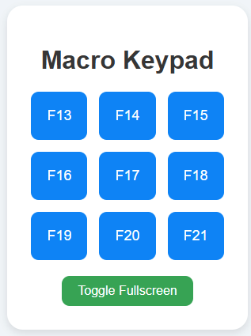

# ExtraKeys

ExtraKeys is a simple web-based keypad that allows you to press a variety of keys using buttons on your web browser. It's designed for ease of use and can be customized for various macro and shortcut needs.



## Features

- Customizable macro keypad for various key presses.
- Can be used for controlling your system (e.g., media controls, shortcuts).
- Built with Flask and runs in your browser.
- Light and dark themes for UI preference.
- Supports fullscreen mode for easy access.

## Setup and Installation

1. Clone the repository to your local machine:
    ```bash
    git clone https://github.com/mustardian/ExtraKeys.git
    cd ExtraKeys
    ```

2. Install the required dependencies:
    ```bash
    pip install -r requirements.txt
    ```

3. Run the application:
    ```bash
    python main.py
    ```

4. Visit `http://localhost:5000` in your web browser to access the keypad interface.

## Examples of How to Use

### 1. **Raspberry Pi as a Wireless Macro Keyboard**

You can use this application on a Raspberry Pi and control your computer as a wireless macro keyboard. By accessing the web interface from the Pi's browser, you can press keys like F13 to F21 to trigger actions on your computer.

#### Steps:
- Set up your Raspberry Pi and ensure it's connected to the same network as your target device.
- Open the browser on the Raspberry Pi and visit the Flask app hosted on your PC (e.g., `http://<PC-IP>:5000`).
- Use the macro buttons as needed to trigger key presses like F13-F21.

### 2. **Stream Deck Alternative**

If you don't have a physical stream deck but need quick access to macro keys for streaming software (e.g., OBS), this web-based keypad serves as a great alternative. You can customize it to send hotkeys that trigger specific actions in your streaming software.

#### Steps:
- Host the Flask application on your PC or server.
- Access the web interface on your main device (e.g., a tablet or phone) connected to the streaming setup.
- Map the macro buttons to actions such as "Start/Stop Stream," "Mute Mic," or "Switch Scenes."

### 3. **Use as Media Control Keypad**

ExtraKeys can also be used as a media control device to send commands like play/pause, volume up/down, or skip. Simply assign the respective keys to the buttons on the keypad.

#### Steps:
- Customize the keys in the Flask app to simulate media control hotkeys.
- Use the app to control music or video playback on your computer.

## Screenshot


## License

This project is licensed under the MIT License - see the [LICENSE](LICENSE) file for details.

---

### How to Contribute

1. Fork the repository by clicking the "Fork" button in the top-right corner of this page.
2. Create a new feature branch:
    ```bash
    git checkout -b feature/my-feature
    ```
3. Commit your changes:
    ```bash
    git commit -am 'Add some feature'
    ```
4. Push to the branch:
    ```bash
    git push origin feature/my-feature
    ```
5. Create a new Pull Request.

